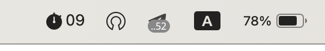

# Nano Pomodoro

An unobtrusive pomodoro widget that just sits in your system tray and starts blinking every 45
minutes. It's annoying enough to be noticed but not enough to get you out of flow state. So when
you're done with your unfinished unit-test or with next paragraph in your paper – go and exercise,
when you're back – reset the timer by clicking on it. That's it.

